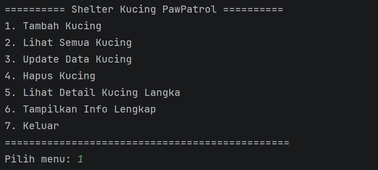

# 🐱 Shelter Kucing PawPatrol - Sistem Manajemen Data Kucing 💫

## 📋 Deskripsi Proyek
Program ini adalah sistem manajemen data untuk shelter kucing bernama "PawPatrol". Program ini memungkinkan pengguna untuk melakukan operasi CRUD (Create, Read, Update, Delete) pada data kucing, dengan menerapkan konsep-konsep Pemrograman Berorientasi Objek (PBO/OOP) seperti Enkapsulasi, Inheritance, dan Polymorphism.

##✨ Fitur Program
Tambah Data Kucing - Menambahkan data kucing baru (biasa atau langka)
Lihat Semua Kucing - Menampilkan seluruh data kucing yang tersimpan
Update Data Kucing - Mengubah data kucing yang sudah ada
Hapus Data Kucing - Menghapus data kucing dari sistem
Lihat Detail Kucing Langka - Demonstrasi akses protected method (Inheritance)
Tampilkan Info Lengkap - Demonstrasi polymorphism pada objek kucing
Keluar - Menutup program

## 🎯 Implementasi Konsep OOP

### 1. Enkapsulasi (Encapsulation)
Implementasi: Class Kucing menggunakan modifier private untuk semua atribut
Atribut Private: id, nama, ras, usia, status
Getter & Setter: Public methods untuk mengakses dan memodifikasi atribut
Validasi: Method setUsia() melakukan validasi agar usia harus > 0

### 2. Inheritance (Pewarisan)
Parent Class: Kucing
Child Class: KucingLangka extends Kucing
Protected Method: getDetailInternal() di class induk dapat diakses oleh class anak
Constructor: Class anak memanggil constructor parent menggunakan super()

### 3. Polymorphism
Method Overriding: Class KucingLangka override method tampilkanInfo() dan getKeterangan()
Parent Reference: ArrayList menggunakan tipe Kucing tetapi dapat menyimpan objek KucingLangka
Dynamic Binding: Saat runtime, Java menentukan method mana yang akan dipanggil berdasarkan objek sebenarnya

### 4. Perulangan (Loops)
Program menggunakan berbagai jenis perulangan:
a. While Loop - Untuk menu utama program
b. For Loop - Untuk iterasi data kucing
c. Enhanced For Loop - Untuk testing polymorphism

### 5. Kondisi dan Percabangan
a. If-Else Statement
b. Switch-Case Statement

## 🖥️ Output Program

### **1. Tampilan Menu Utama**

*Menu utama dengan 7 pilihan fitur*

### **2. Tambah Data Kucing**

*Form input untuk menambah kucing baru*

### **3. Lihat Semua Data**

*Menampilkan seluruh data kucing dalam shelter*

### **4. Update Data**

*Mengubah data kucing berdasarkan ID*

### **5. Hapus Data**

*Menghapus data kucing dari sistem*

### **6. Detail Kucing Langka**

*Demonstrasi protected access pada kucing langka*

### **7. Tes Polymorphism**

*Demonstrasi polymorphism dengan output berbeda*

### **8. Keluar Program**

*keluar dan menghentikan program*

## 😺 Pembuat Program
Nama: Triya Khairun Nisa
NIM: 2409106038
Program Studi: Informatika
Kelas: Informartika A'24
