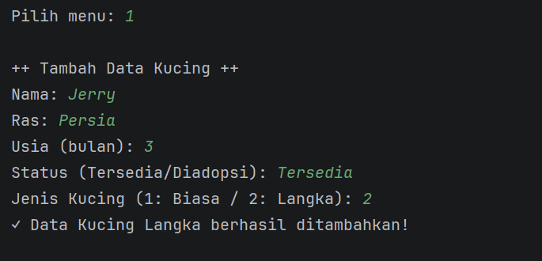
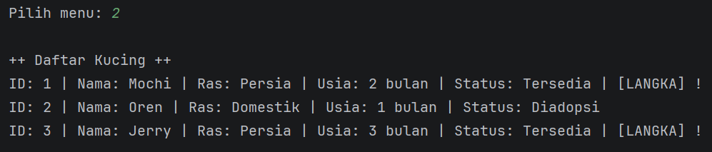
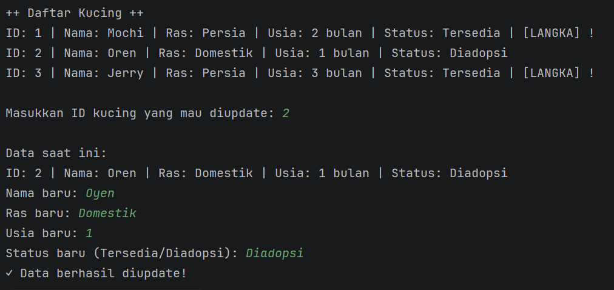
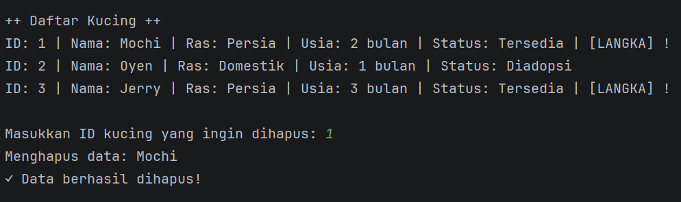
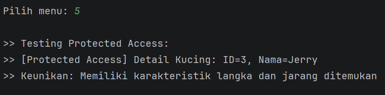
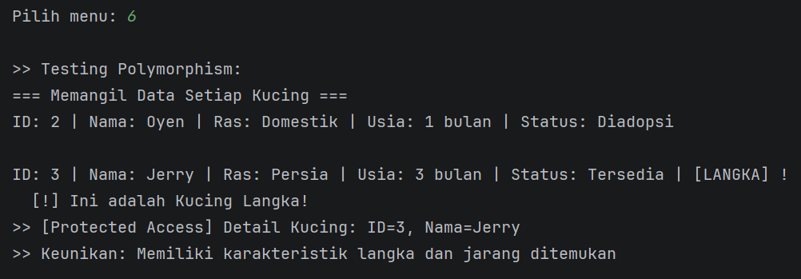
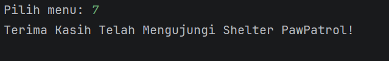

# 🐱 Shelter Kucing PawPatrol - Sistem Manajemen Data Kucing 💫

## 📋 Deskripsi Proyek
Program ini adalah sistem manajemen data untuk shelter kucing bernama "PawPatrol". Program ini memungkinkan pengguna untuk melakukan operasi CRUD (Create, Read, Update, Delete) pada data kucing, dengan menerapkan konsep-konsep Pemrograman Berorientasi Objek (PBO/OOP) seperti **Enkapsulasi**, **Inheritance**, dan **Polymorphism**.

---

## ✨ Fitur Program
1. **Tambah Data Kucing** - Menambahkan data kucing baru (biasa atau langka)
2. **Lihat Semua Kucing** - Menampilkan seluruh data kucing yang tersimpan
3. **Update Data Kucing** - Mengubah data kucing yang sudah ada
4. **Hapus Data Kucing** - Menghapus data kucing dari sistem
5. **Lihat Detail Kucing Langka** - Demonstrasi akses protected method (Inheritance)
6. **Tampilkan Info Lengkap** - Demonstrasi polymorphism pada objek kucing
7. **Keluar** - Menutup program

---

## 🎯 Implementasi Konsep OOP

### 1. Enkapsulasi (Encapsulation)
- **Implementasi**: Class `Kucing` menggunakan modifier `private` untuk semua atribut
- **Atribut Private**: `id`, `nama`, `ras`, `usia`, `status`
- **Getter & Setter**: Public methods untuk mengakses dan memodifikasi atribut
- **Validasi**: Method `setUsia()` melakukan validasi agar usia harus > 0

### 2. Inheritance 
- **Parent Class**: `Kucing`
- **Child Class**: `KucingLangka extends Kucing`
- **Protected Method**: `getDetailInternal()` di class induk dapat diakses oleh class anak
- **Constructor**: Class anak memanggil constructor parent menggunakan `super()`

### 3. Polymorphism
- **Method Overriding**: Class `KucingLangka` override method `tampilkanInfo()` dan `getKeterangan()`
- **Parent Reference**: ArrayList menggunakan tipe `Kucing` tetapi dapat menyimpan objek `KucingLangka`
- **Dynamic Binding**: Saat runtime, Java menentukan method mana yang akan dipanggil berdasarkan objek sebenarnya

### 4. Perulangan (Loops)
Program menggunakan berbagai jenis perulangan:
- **While Loop** - Untuk menu utama program
- **For Loop** - Untuk iterasi data kucing
- **Enhanced For Loop** - Untuk testing polymorphism

### 5. Kondisi dan Percabangan
- **If-Else Statement** - Untuk pengambilan keputusan
- **Switch-Case Statement** - Untuk menu program

---

## 🖼️ Dokumentasi Fitur

### **1. Tampilan Menu Utama**
  
*Menu utama dengan 7 pilihan fitur*

### **2. Tambah Data Kucing**
  
*Form input untuk menambah kucing baru*

### **3. Lihat Semua Data**
  
*Menampilkan seluruh data kucing dalam shelter*

### **4. Update Data**
  
*Mengubah data kucing berdasarkan ID*

### **5. Hapus Data**
  
*Menghapus data kucing dari sistem*

### **6. Detail Kucing Langka**
  
*Demonstrasi protected access pada kucing langka*

### **7. Tampilkan Info Lengkap**
  
*Demonstrasi polymorphism dengan output berbeda*

### **8. Keluar Program**
  
*Keluar dan menghentikan program*

---

## 👩‍💻 Informasi Pembuat

**Nama** : Triya Khairun Nisa  
**NIM** : 2409106038  
**Program Studi** : Informatika  
**Kelas** : Informatika A'24

---
